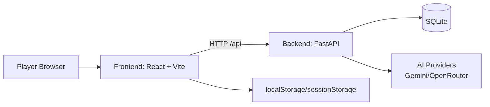
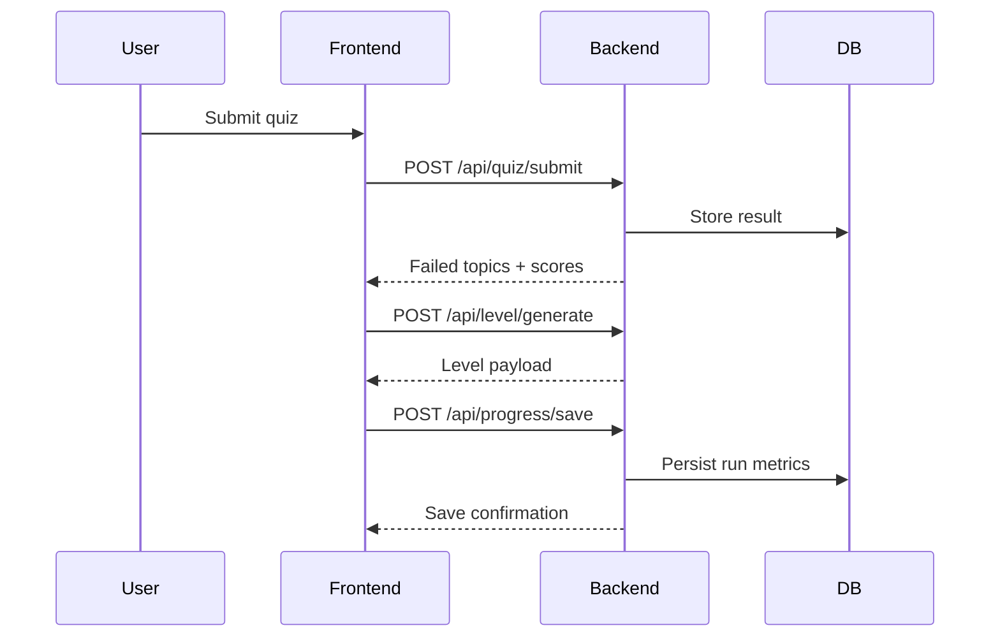

# WASM-RPG Neofuture


Adaptive learning RPG where quiz weaknesses generate targeted dungeons, lessons, and combat prompts.

## Table of Contents

- [Overview](#overview)
- [Key Features](#key-features)
- [Architecture](#architecture)
- [Project Structure](#project-structure)
- [User Flows](#user-flows)
- [Tech Stack](#tech-stack)
- [Quick Start](#quick-start)
- [Manual Setup](#manual-setup)
- [Configuration](#configuration)
- [API Overview](#api-overview)
- [Quality and Testing](#quality-and-testing)
- [Production Hardening](#production-hardening)
- [Deployment Notes](#deployment-notes)
- [Troubleshooting](#troubleshooting)
- [Documentation Index](#documentation-index)
- [Contributing](#contributing)
- [Security](#security)
- [Roadmap](#roadmap)
- [FAQ](#faq)
- [License](#license)
- [Maintainers](#maintainers)

---

## Overview

WASM-RPG Neofuture combines adaptive assessment with game mechanics:

1. Learner takes a quiz.
2. Backend identifies weak topics.
3. System generates topic-aligned dungeon content.
4. Learner completes lesson, challenge, and combat sequence.
5. Progress and telemetry are stored for review.

The repository contains a React frontend and a FastAPI backend with SQLite persistence and optional AI-based grading/lesson generation.

> [!IMPORTANT]
> This project currently has no dedicated LICENSE file in the repository root. Add one before public redistribution.

## Key Features

- Adaptive quiz-to-dungeon generation pipeline.
- Procedural and prebuilt level support.
- Dedicated map screen for direct dungeon selection.
- Lesson generation with provider fallback strategy.
- AI-assisted answer grading with heuristic fallback.
- Progress tracking and telemetry endpoints.
- Production hardening:
	- Request logging with request IDs.
	- Configurable in-memory rate limiting.
	- Frontend retry/backoff for idempotent API calls.
	- Environment-driven CORS behavior.

## Architecture



### Runtime Flow



## Project Structure

```text
wasm-rpg-neofuture/
	frontend/                     # React + TypeScript + Vite client
		src/
			pages/                    # Home, Quiz, Results, Lesson, Challenge, Game, Map, Progress
			components/               # Navbar, ErrorBoundary, etc.
			lib/                      # axios API client, fallback grading logic
			types/                    # shared frontend type models
	member2/backend/              # FastAPI backend
		app/
			routes/                   # quiz, level, lesson, grading, progress, telemetry
			services/                 # AI and generation logic
			models/                   # Pydantic schemas
			database.py               # SQLite setup and helpers
		levels/                     # prebuilt level JSON files
		test_api.py                 # endpoint smoke tests
		test_grading.py             # grading service script
	shared/                       # shared assets/schemas
	start.sh                      # one-command launcher (Linux/macOS)
	start.bat                     # one-command launcher (Windows)
	verify.js                     # repo-wide verification harness
```

## User Flows

### Primary Learning Path

`/` -> `/quiz` -> `/results` -> `/lesson` -> `/challenge` -> `/game` -> `/progress`

### Direct Dungeon Path

`/` -> `/map` -> `/game?topic=<topic>`

## Tech Stack

| Layer | Technology |
|---|---|
| Frontend | React 18, TypeScript, Vite, React Router, TailwindCSS, Axios |
| Backend | FastAPI, Pydantic, Uvicorn, aiosqlite |
| Data | SQLite (WAL mode) |
| AI Integration | Google Gemini, OpenRouter (config-driven provider selection) |
| Tooling | ESLint, TypeScript compiler, Python scripts |

## Quick Start

### One-command launcher

Linux/macOS:

```bash
chmod +x start.sh
./start.sh
```

Windows:

```bat
start.bat
```

Default local URLs:

- Frontend: `http://localhost:5173`
- Backend: `http://localhost:8000`
- API docs: `http://localhost:8000/docs`

## Manual Setup

### Prerequisites

- Node.js 18+
- npm 9+
- Python 3.10+
- Git

### 1) Backend setup

```bash
cd member2/backend
python -m venv .venv
source .venv/bin/activate
pip install -r requirements.txt
cp .env.example .env
python -m uvicorn app.main:app --reload --host 127.0.0.1 --port 8000
```

### 2) Frontend setup

```bash
cd frontend
npm install
npm run dev -- --host 0.0.0.0 --port 5173
```

## Configuration

### Backend environment

Backend config template: `member2/backend/.env.example`

| Variable | Purpose | Example |
|---|---|---|
| `ENV` | Runtime mode (`development` or `production`) | `production` |
| `CORS_ORIGINS` | Allowed origins when in production | `https://app.example.com` |
| `LESSON_AI_PROVIDER` | AI provider selector (`auto`, `gemini`, `openrouter`) | `auto` |
| `GEMINI_API_KEY` | Gemini key (optional) | `...` |
| `OPENROUTER_API_KEY` | OpenRouter key (optional) | `...` |
| `LOG_LEVEL` | API log verbosity | `INFO` |
| `LOG_HEALTHCHECKS` | Include `/health` in logs | `false` |
| `RATE_LIMIT_ENABLED` | Enable request throttling | `true` |
| `RATE_LIMIT_REQUESTS` | Max requests per window per client IP | `120` |
| `RATE_LIMIT_WINDOW_SECONDS` | Sliding window size | `60` |
| `RATE_LIMIT_EXEMPT_PATHS` | Comma-separated exempt paths | `/health,/docs,/openapi.json,/redoc` |

### Frontend environment

Files:

- `frontend/.env.development`
- `frontend/.env.production`

| Variable | Purpose | Default |
|---|---|---|
| `VITE_API_BASE_URL` | Base URL for API requests | `` (dev), `/api` (prod) |
| `VITE_API_TIMEOUT_MS` | Axios timeout in milliseconds | `15000` |
| `VITE_API_RETRY_COUNT` | Retry attempts for idempotent requests | `2` |
| `VITE_API_RETRY_DELAY_MS` | Initial retry delay (exponential backoff) | `400` |
| `VITE_ENABLE_DEMO_MODE` | Demo-mode feature switch | `false` |
| `VITE_ENABLE_DEBUG_LOGGING` | Frontend debug logs | `true` dev / `false` prod |

## API Overview

### Health

| Method | Endpoint | Description |
|---|---|---|
| GET | `/` | Service metadata and endpoint index |
| GET | `/health` | Health probe |

### Quiz

| Method | Endpoint |
|---|---|
| GET | `/api/quiz/questions` |
| GET | `/api/quiz/questions/{topic}` |
| POST | `/api/quiz/submit` |
| GET | `/api/quiz/demo` |
| POST | `/api/quiz/demo/submit` |

### Level

| Method | Endpoint |
|---|---|
| POST | `/api/level/generate` |
| GET | `/api/level/preview` |
| GET | `/api/level/prebuilt/{topic}` |
| GET | `/api/level/list-prebuilt` |

### Lessons and Grading

| Method | Endpoint |
|---|---|
| POST | `/api/lesson/generate` |
| GET | `/api/lesson/{topic}` |
| POST | `/api/grade/answer` |

### Progress and Telemetry

| Method | Endpoint |
|---|---|
| POST | `/api/progress/save` |
| GET | `/api/progress/{student_id}` |
| POST | `/api/telemetry/event` |
| POST | `/api/telemetry/quiz-completed` |
| POST | `/api/telemetry/dungeon-completed` |
| POST | `/api/telemetry/boss-defeated` |
| GET | `/api/telemetry/kpi/{student_id}` |
| GET | `/api/telemetry/events` |
| GET | `/api/telemetry/ab-test-status` |

## Quality and Testing

### Frontend checks

```bash
cd frontend
npm run lint
npm run build
```

### Backend checks

```bash
cd member2/backend
python -m py_compile app/main.py app/routes/*.py app/services/*.py
```

### API smoke tests

Start backend first, then:

```bash
cd member2/backend
python test_api.py
```

### System verification harness

```bash
node verify.js
```

## Production Hardening

This repository now includes several runtime hardening controls:

- Structured request logging middleware with request IDs.
- Configurable in-memory rate limiting middleware.
- Environment-aware CORS setup.
- Frontend axios retry/backoff for idempotent requests.
- API timeout and retry controls through environment variables.

> [!NOTE]
> The in-memory limiter is process-local. For distributed deployments, move rate limiting to an external shared store or API gateway.

## Deployment Notes

Use these minimum production settings:

1. Set backend `ENV=production`.
2. Set strict `CORS_ORIGINS` allowlist.
3. Keep `RATE_LIMIT_ENABLED=true`.
4. Set real `OPENROUTER_API_KEY` and/or `GEMINI_API_KEY` in backend `.env`.
5. Build frontend with production env values.

Example production frontend build:

```bash
cd frontend
npm ci
npm run build
```

## Troubleshooting

<details>
<summary>Port 8000 already in use</summary>

- Identify process using the port.
- Stop it or run backend on a different port.
- If you use `start.sh`, it expects backend health on port 8000.

</details>

<details>
<summary>Frontend cannot reach backend</summary>

- Verify backend is running and healthy at `/health`.
- Confirm `VITE_API_BASE_URL` and any reverse-proxy routes.
- Check browser network panel for CORS/timeout errors.

</details>

<details>
<summary>AI lesson/grading responses missing</summary>

- Validate backend `.env` keys.
- Ensure `LESSON_AI_PROVIDER` is set appropriately.
- Check backend logs for provider or rate-limit failures.

</details>

## Documentation Index

| Area | File |
|---|---|
| Implementation plan | `implementation_plan.md` |
| Launch checklist | `LAUNCH_CHECKLIST.md` |
| Testing guide | `TESTING_GUIDE.md` |
| Test outputs | `TEST_RESULTS.md` |
| Production audit notes | `PRODUCTION_AUDIT_COMPLETE.md` |
| Changelog snapshot | `CHANGELOG_v2.0.0.md` |

## Contributing

1. Create a feature branch from `main`.
2. Keep changes scoped and documented.
3. Run lint/build/tests locally.
4. Submit a PR with:
	 - Problem statement
	 - Solution summary
	 - Test evidence

Recommended local pre-PR checks:

```bash
cd frontend && npm run lint && npm run build
cd ../member2/backend && python -m py_compile app/main.py app/routes/*.py app/services/*.py
```

## Security

- Never commit secrets to Git.
- Use `member2/backend/.env` for local secrets only.
- Rotate API keys if exposure is suspected.
- Restrict CORS origins and keep rate limiting enabled in production.

If you find a security issue, open a private channel with maintainers instead of filing public exploit details.

## Roadmap

- [x] Adaptive quiz and dungeon generation
- [x] Map route and direct dungeon entry flow
- [x] AI grading endpoint integration
- [x] Request logging and rate limiting middleware
- [ ] Shared/distributed rate limiting backend
- [ ] End-to-end browser tests in CI
- [ ] Public deployment manifests
- [ ] Accessibility pass across all screens

## FAQ

### Is this project WASM-based end-to-end?

The gameplay concept is WASM-oriented, but the current implementation stack is React + FastAPI with SQLite and AI service integrations.

### Can I run without AI keys?

Yes. Some features include fallback behavior, but AI-dependent endpoints provide best results with valid provider credentials.

### Where are game assets stored?

In `frontend/public/game-assets`.

### Does this repository include CI pipelines?

No `.github/workflows` pipeline is currently present in the repository.

## License

No license file is currently present. Add a `LICENSE` file to define terms of use.

## Maintainers

- Repository owner: `MrDunky14`

---

If this README helped, consider adding a release note update in `CHANGELOG_v2.0.0.md` when shipping major changes.
