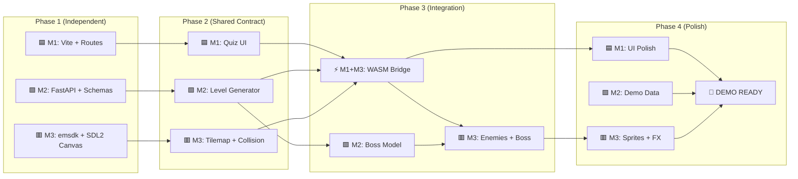

# WASM-RPG: Complete Project Implementation Guide

> **Project:** Adaptive Native-Speed Learning Engine (PS-201)
> **Concept:** "Mechanic-as-Metaphor" — students play through dungeons where game physics are governed by the academic concepts they need to master.

---

## 1. PRD Summary

The system has **three decoupled tiers**:

| Tier | Technology | Role |
|------|-----------|------|
| **Tier 1 — The Shell** | React + Vite PWA | Student dashboard, diagnostic quizzes, hosts the `<canvas>` for the WASM game |
| **Tier 2 — The AI Brain** | FastAPI + Python | Analyzes quiz results, generates structured JSON level payloads |
| **Tier 3 — The Game Engine** | C++ → WebAssembly (Emscripten + SDL2) | Consumes JSON data, procedurally generates dungeon world, renders to canvas |

**MVP Goal (24h Hackathon):** Build the complete pipeline and one concept-based dungeon level.

---

## 2. Recommended Tech Stack

### Tier 1: Frontend (React PWA)

| Tool | Version | Purpose |
|------|---------|---------|
| **React** | 18+ | Component-based UI framework |
| **Vite** | 5+ | Lightning-fast dev server & bundler |
| **vite-plugin-pwa** | latest | Auto-generates service worker & manifest |
| **React Router** | 6+ | Client-side routing (quiz → game → results) |
| **Axios** | latest | HTTP client for FastAPI communication |

**Setup Command:**
```bash
npx -y create-vite@latest ./ --template react
npm install react-router-dom axios
npm install -D vite-plugin-pwa
```

**PWA Config (`vite.config.js`):**
```javascript
import { defineConfig } from 'vite'
import react from '@vitejs/plugin-react'
import { VitePWA } from 'vite-plugin-pwa'

export default defineConfig({
  plugins: [
    react(),
    VitePWA({
      registerType: 'autoUpdate',
      manifest: {
        name: 'WASM-RPG Learning Engine',
        short_name: 'WASM-RPG',
        theme_color: '#1a1a2e',
        icons: [
          { src: 'pwa-192x192.png', sizes: '192x192', type: 'image/png' },
          { src: 'pwa-512x512.png', sizes: '512x512', type: 'image/png' }
        ]
      }
    })
  ],
  server: {
    proxy: { '/api': 'http://localhost:8000' }  // dev proxy to FastAPI
  }
})
```

---

### Tier 2: Backend (FastAPI)

| Tool | Version | Purpose |
|------|---------|---------|
| **FastAPI** | 0.100+ | Async Python web framework |
| **Uvicorn** | latest | ASGI server |
| **SQLite** | built-in | Lightweight DB for quiz data & user progress |
| **Pydantic** | 2+ | Data validation & JSON schema generation |

**Setup Commands:**
```bash
pip install fastapi uvicorn pydantic aiosqlite
```

**Core API Endpoints:**
```python
# POST /api/quiz/submit   → Receives quiz answers, returns score
# GET  /api/level/generate → Returns JSON level payload based on failures
# POST /api/progress/save  → Saves game completion data
```

---

### Tier 3: Game Engine (C++ / WebAssembly)

| Tool | Version | Purpose |
|------|---------|---------|
| **Emscripten SDK (emsdk)** | latest | C++ → WebAssembly compiler toolchain |
| **SDL2** | (bundled with emsdk) | Cross-platform multimedia library (input, rendering, audio) |
| **nlohmann/json** | latest | Header-only C++ JSON parser |
| **CMake** | 3.20+ | Cross-platform build system |

**Emscripten Installation:**
```bash
git clone https://github.com/emscripten-core/emsdk.git
cd emsdk
./emsdk install latest
./emsdk activate latest
source ./emsdk_env.sh      # Linux/Mac
# emsdk_env.bat             # Windows
```

**Build Command:**
```bash
emcmake cmake -B build .
cmake --build build

# Or directly with emcc:
emcc src/main.cpp src/game.cpp -o dist/game.js \
  -s USE_SDL=2 \
  -s USE_SDL_IMAGE=2 \
  -s SDL2_IMAGE_FORMATS='["png"]' \
  -s EXPORTED_RUNTIME_METHODS='["ccall","cwrap"]' \
  -s ASYNCIFY \
  --preload-file assets/
```

---

## 3. Core Concepts You Must Understand

### 3.1 WebAssembly (WASM) Fundamentals
- **What:** Binary instruction format that runs in browsers at near-native speed
- **Why:** The 16-bit RPG engine needs high-performance rendering impossible in pure JS
- **Key Constraint:** Cannot use `while(true)` game loops — must use `emscripten_set_main_loop`

```cpp
#include <emscripten.h>
#include <SDL2/SDL.h>

void game_loop() {
    // 1. Process SDL_Events (input)
    // 2. Update game state
    // 3. Render frame to canvas
}

int main() {
    SDL_Init(SDL_INIT_VIDEO);
    SDL_CreateWindow("WASM-RPG", 0, 0, 640, 480, 0);
    emscripten_set_main_loop(game_loop, 0, 1);  // 0 = use requestAnimationFrame
    return 0;
}
```

### 3.2 Emscripten Virtual File System
- Assets (sprites, JSON maps) are bundled with `--preload-file assets/`
- In C++ code, use standard `std::ifstream` or `SDL_RWFromFile` to read them
- Files are packed into a `.data` blob downloaded alongside the `.wasm` binary

### 3.3 JS ↔ WASM Bridge (The Critical Integration Point)
This is how React passes the JSON level payload into the running WASM game:

```cpp
// C++ side — exposed function
extern "C" {
    EMSCRIPTEN_KEEPALIVE
    void load_level(const char* json_str) {
        nlohmann::json level = nlohmann::json::parse(json_str);
        int width = level["width"];
        int height = level["height"];
        auto tiles = level["tiles"];  // 2D array of tile IDs
        // ... build the dungeon from this data
    }
}
```

```javascript
// React side — calling into WASM
const levelData = await axios.get('/api/level/generate');
Module.ccall('load_level', null, ['string'], [JSON.stringify(levelData.data)]);
```

### 3.4 Procedural Dungeon Generation
Algorithms to consider (implement in C++ or Python, depending on where generation happens):

| Algorithm | Best For | Complexity |
|-----------|----------|------------|
| **Random Walk** | Cave-like organic dungeons | Low |
| **BSP (Binary Space Partitioning)** | Rooms connected by corridors | Medium |
| **Cellular Automata** | Smooth, natural-feeling caves | Medium |

**For the MVP:** Use simple tilemap-from-JSON. The FastAPI backend generates the tile layout; C++ just renders it.

### 3.5 SDL2 Tilemap Rendering
```cpp
// Load tileset spritesheet
SDL_Surface* surface = IMG_Load("assets/tileset.png");
SDL_Texture* tileset = SDL_CreateTextureFromSurface(renderer, surface);

// Render each tile
for (int y = 0; y < mapHeight; y++) {
    for (int x = 0; x < mapWidth; x++) {
        int tileID = tiles[y][x];
        SDL_Rect src = { (tileID % cols) * 16, (tileID / cols) * 16, 16, 16 };
        SDL_Rect dst = { x * 16, y * 16, 16, 16 };
        SDL_RenderCopy(renderer, tileset, &src, &dst);
    }
}
```

### 3.6 Collision Detection (AABB)
Simple axis-aligned bounding box collision for tile-based movement:
```cpp
bool collides(SDL_Rect a, SDL_Rect b) {
    return a.x < b.x + b.w && a.x + a.w > b.x &&
           a.y < b.y + b.h && a.y + a.h > b.y;
}
```

---

## 4. Project Directory Structure

```
wasm-rpg/
├── frontend/                    # React + Vite PWA
│   ├── public/
│   │   ├── wasm/               # Compiled WASM output goes here
│   │   │   ├── game.js
│   │   │   ├── game.wasm
│   │   │   └── game.data
│   │   ├── pwa-192x192.png
│   │   └── pwa-512x512.png
│   ├── src/
│   │   ├── components/
│   │   │   ├── Dashboard.jsx    # Student home screen
│   │   │   ├── QuizScreen.jsx   # Diagnostic quiz interface
│   │   │   ├── GameCanvas.jsx   # Hosts <canvas> & WASM loader
│   │   │   └── ResultsScreen.jsx
│   │   ├── services/
│   │   │   └── api.js           # Centralized API calls
│   │   ├── App.jsx
│   │   └── main.jsx
│   ├── vite.config.js
│   └── package.json
│
├── backend/                     # FastAPI + Python
│   ├── app/
│   │   ├── main.py              # FastAPI app entry
│   │   ├── routes/
│   │   │   ├── quiz.py          # Quiz submission endpoints
│   │   │   └── level.py         # Level generation endpoints
│   │   ├── models/
│   │   │   └── schemas.py       # Pydantic models
│   │   └── services/
│   │       └── level_generator.py  # Quiz-failure → dungeon-JSON mapper
│   ├── database.db
│   └── requirements.txt
│
├── engine/                      # C++ Game Engine
│   ├── src/
│   │   ├── main.cpp             # Entry point + emscripten_set_main_loop
│   │   ├── game.cpp / game.h    # Core game state & logic
│   │   ├── renderer.cpp / .h    # SDL2 rendering, tilemap drawing
│   │   ├── player.cpp / .h      # Player movement & input
│   │   ├── collision.cpp / .h   # AABB collision system
│   │   └── level_loader.cpp / .h # JSON parsing & level data
│   ├── include/
│   │   └── nlohmann/json.hpp    # Header-only JSON library
│   ├── assets/                  # Bundled into WASM via --preload-file
│   │   ├── tileset.png
│   │   ├── player.png
│   │   └── enemies.png
│   ├── CMakeLists.txt
│   └── build.sh
│
└── README.md
```

---

## 5. External Assets (Free, Ready to Download)

> [!IMPORTANT]
> The PRD specifies: **"Use free itch.io assets, do not draw your own."**

### 🎨 Tileset & Dungeon Assets

| Asset | Creator | Link | Details |
|-------|---------|------|---------|
| **16x16 DungeonTileset II** | 0x72 | [itch.io/0x72/dungeontileset-ii](https://0x72.itch.io/dungeontilesetii) | 16×16 tiles, walls, floors, doors, props, animated characters, monsters. **Best choice for this project.** CC0 license. |
| **16x16 Dungeon Tileset (Original)** | 0x72 | [itch.io/0x72/16x16-dungeon-tileset](https://0x72.itch.io/16x16-dungeon-tileset) | Classic dungeon set, simpler but cohesive. CC0. |
| **1-Bit Pack** | Kenney | [kenney.nl/assets/1-bit-pack](https://kenney.nl/assets/1-bit-pack) | 1000+ monochrome sprites (tiles, chars, objects, UI). CC0. |
| **Micro Roguelike** | Kenney | [kenney.nl/assets/micro-roguelike](https://kenney.nl/assets/micro-roguelike) | Tiny RPG/roguelike sprites. CC0. |

### 👤 Character & Enemy Sprites

| Asset | Creator | Link | Details |
|-------|---------|------|---------|
| **Ninja Adventure** | Pixel-boy | [pixel-boy.itch.io/ninja-adventure-asset-pack](https://pixel-boy.itch.io/ninja-adventure-asset-pack) | Massive top-down RPG pack: characters, enemies, tilesets, UI, effects. CC0. |
| **Pixel Dungeon Sprites** | (included in DungeonTileset II) | see above | Characters & enemies already included |

### 🖌️ UI Assets

| Asset | Creator | Link | Details |
|-------|---------|------|---------|
| **UI Pack: RPG Extension** | Kenney | [kenney.nl/assets/ui-pack-rpg-expansion](https://kenney.nl/assets/ui-pack-rpg-expansion) | Health bars, panels, buttons, inventory UI. CC0. |
| **Game Icons** | Kenney | [kenney.nl/assets/game-icons](https://kenney.nl/assets/game-icons) | 500+ icons for items, abilities, etc. CC0. |

### 🔊 Sound Effects (Optional Polish)

| Asset | Creator | Link | Details |
|-------|---------|------|---------|
| **RPG Sound Effects** | Kenney | [kenney.nl/assets](https://kenney.nl/assets) | Search for "RPG" in Kenney's library — multiple free packs |
| **Shapeforms Audio** | Shapeforms | [shapeforms.itch.io](https://shapeforms.itch.io) | Free retro game audio packs. CC0. |

### 📖 How to Use the Assets
1. Download the asset pack ZIP from the link
2. Extract the PNGs into `engine/assets/`
3. Ensure sprites are on a **16×16 grid** (most of the above already are)
4. Reference the tileset in your C++ renderer using `SDL_Rect` source coordinates
5. The `--preload-file assets/` flag bundles them into the WASM build

---

## 6. JSON Level Payload Format

The bridge between FastAPI (Tier 2) and the C++ Engine (Tier 3). This is the most critical data contract:

```json
{
  "level_name": "Stack Dungeon",
  "concept": "data_structures_stack",
  "difficulty": 3,
  "width": 20,
  "height": 15,
  "tiles": [
    [1,1,1,1,1,1,1,1,1,1,1,1,1,1,1,1,1,1,1,1],
    [1,0,0,0,0,0,0,0,0,0,0,0,0,0,0,0,0,0,0,1],
    [1,0,0,0,0,0,0,0,0,0,0,0,0,0,0,0,0,0,0,1],
    "... (0 = floor, 1 = wall, 2 = door, 3 = enemy spawn, 4 = objective)"
  ],
  "player_start": { "x": 1, "y": 1 },
  "objective": { "x": 18, "y": 13, "type": "reach_exit" },
  "enemies": [
    { "type": "stack_guardian", "x": 10, "y": 7, "hp": 50, "concept_question": "What is LIFO?" }
  ],
  "boss": {
    "type": "stack_boss",
    "hp": 100,
    "mechanic": "push_pop_sequence",
    "description": "Defeat by executing correct stack operations"
  }
}
```

---

## 7. 3-Person Parallel Working Plan (24-Hour Hackathon)

> **Roles:**
> - 🟦 **M1 (Member 1)** — Frontend (React + Vite PWA)
> - 🟩 **M2 (Member 2)** — Backend (FastAPI + Python)
> - 🟥 **M3 (Member 3)** — Game Engine (C++ + WebAssembly)

### Visual Timeline

```mermaid
gantt
    title WASM-RPG 24h Hackathon — Parallel Plan
    dateFormat HH:mm
    axisFormat %H:%M

    section M1 Frontend
    Vite + React scaffold         :m1a, 00:00, 1h
    Routing + page shells         :m1b, after m1a, 1h
    PWA config + manifest         :m1c, after m1b, 1h
    GameCanvas component          :m1d, after m1c, 1h
    Quiz UI (questions + submit)  :m1e, 04:00, 3h
    Quiz ↔ API integration        :m1f, after m1e, 2h
    Results screen + score display:m1g, after m1f, 1h
    WASM loader in GameCanvas     :m1h, after m1g, 2h
    JS → WASM bridge (ccall)      :crit, m1i, 12:00, 3h
    Game screen ↔ dynamic levels  :m1j, after m1i, 2h
    UI polish + dark theme        :m1k, 18:00, 3h
    Final demo flow testing       :m1l, 21:00, 3h

    section M2 Backend
    FastAPI + SQLite scaffold     :m2a, 00:00, 1h
    Pydantic schemas              :m2b, after m2a, 1h
    Quiz endpoints (CRUD)         :m2c, after m2b, 2h
    Quiz question bank (JSON)     :m2d, 04:00, 2h
    Level generator service       :m2e, after m2d, 3h
    Level JSON payload builder    :m2f, after m2e, 2h
    API tested with Postman/curl  :m2g, after m2f, 1h
    Boss mechanic data model      :m2h, 12:00, 2h
    Progress save endpoint        :m2i, after m2h, 2h
    Help M1 with integration      :m2j, after m2i, 2h
    CORS + deployment polish      :m2k, 18:00, 2h
    Demo data seeding + testing   :m2l, 20:00, 4h

    section M3 Engine
    Install emsdk + verify        :m3a, 00:00, 1h
    SDL2 blank canvas to browser  :m3b, after m3a, 2h
    Player rect + keyboard input  :m3c, after m3b, 1h
    Tilemap renderer (hardcoded)  :m3d, 04:00, 3h
    Player movement + collision   :m3e, after m3d, 3h
    nlohmann JSON level loader    :m3f, after m3e, 2h
    Expose load_level via ccall   :crit, m3g, 12:00, 3h
    Enemy rendering + basic AI    :m3h, after m3g, 2h
    Boss encounter logic          :m3i, after m3h, 2h
    Sprite asset integration      :m3j, 18:00, 3h
    Polish animations + SFX       :m3k, 21:00, 3h
```



---

### Phase 1: Foundation (Hours 0–4) — Everyone Works Independently

> [!IMPORTANT]
> **No dependencies in this phase.** All 3 members can work in complete isolation.

#### 🟦 M1 — Frontend Setup
| Hour | Task | Details | Deliverable |
|------|------|---------|-------------|
| 0–1 | Scaffold project | `npx -y create-vite@latest ./ --template react` → `npm install react-router-dom axios` | Vite dev server running |
| 1–2 | Setup routing | Create route structure: `/` → Dashboard, `/quiz` → QuizScreen, `/game` → GameCanvas, `/results` → Results | All pages render (empty shells) |
| 2–3 | PWA config | `npm i -D vite-plugin-pwa` → configure `vite.config.js` with manifest, icons, service worker | PWA installable |
| 3–4 | GameCanvas component | Create `GameCanvas.jsx` with a `<canvas id="canvas">` element + placeholder WASM loader scaffold | Canvas element renders on `/game` |

#### 🟩 M2 — Backend Setup
| Hour | Task | Details | Deliverable |
|------|------|---------|-------------|
| 0–1 | Scaffold FastAPI | `pip install fastapi uvicorn pydantic aiosqlite` → create `app/main.py` with CORS middleware | Server runs on `:8000` |
| 1–2 | Define Pydantic schemas | `QuizSubmission`, `QuizResult`, `LevelPayload`, `PlayerProgress` models in `schemas.py` | Type-safe request/response models |
| 2–4 | Quiz CRUD endpoints | `POST /api/quiz/submit` (evaluates answers, returns score + failed topics), `GET /api/quiz/questions` (returns question bank) | Endpoints testable with `curl` |

#### 🟥 M3 — Engine Setup
| Hour | Task | Details | Deliverable |
|------|------|---------|-------------|
| 0–1 | Install Emscripten | Clone emsdk → `./emsdk install latest` → `./emsdk activate latest` → verify `emcc --version` | emsdk working |
| 1–3 | Blank canvas to browser | Write `main.cpp` with `SDL_Init`, `SDL_CreateWindow`, `emscripten_set_main_loop` → compile → serve HTML | Blank SDL window renders in browser |
| 3–4 | Player rectangle + input | Draw a colored rectangle as player → handle `SDL_KEYDOWN` for arrow keys → move rectangle | Player rect moves with arrow keys |

#### 🔄 SYNC CHECKPOINT #1 (Hour 4)
```
✅ Verify: Vite dev server running with routes
✅ Verify: FastAPI returning quiz questions on GET
✅ Verify: WASM canvas rendering + player rect moves
📋 Agree: JSON level payload format (Section 6 of this doc)
📋 Share: M2 gives M1 the API endpoint URLs for quiz
```

---

### Phase 2: Core Features (Hours 4–12) — Parallel with Shared Contract

> [!TIP]
> **Critical contract agreed at Sync #1:** The JSON level payload format. M2 builds the generator, M3 builds the consumer. Both code against the same schema.

#### 🟦 M1 — Quiz UI + API Integration
| Hour | Task | Details |
|------|------|---------|
| 4–7 | Build Quiz UI | Multiple-choice question cards, topic selector, timer (optional), submit button. Style with modern dark theme. |
| 7–9 | Quiz ↔ API wiring | On submit → `axios.post('/api/quiz/submit', answers)` → receive score + failed topics → store in state |
| 9–10 | Results screen | Display score breakdown by topic. "Enter Dungeon" button navigates to `/game` with failed topics as URL params |

#### 🟩 M2 — Level Generation Engine
| Hour | Task | Details |
|------|------|---------|
| 4–6 | Quiz question bank | Create JSON file with 20+ questions across topics (Math, Data Structures, Algorithms). Categorize by concept. |
| 6–9 | Level generator service | `level_generator.py`: input = list of failed topics → output = JSON level payload. Maps topic → dungeon theme, enemy types, boss mechanic. |
| 9–11 | Level JSON payload builder | Implement `GET /api/level/generate?topics=stack,sorting` → returns complete dungeon JSON with tiles, enemies, boss, player spawn |
| 11–12 | Test all endpoints | Verify full flow: submit quiz → get failures → generate level → validate JSON structure |

#### 🟥 M3 — Game Mechanics
| Hour | Task | Details |
|------|------|---------|
| 4–7 | Tilemap renderer | Load a hardcoded 2D tile array → render using SDL2 `SDL_RenderCopy` from tileset spritesheet → camera viewport |
| 7–10 | Player movement + collision | Replace raw input with smooth tile-based movement → AABB collision against wall tiles → prevent walking through walls |
| 10–12 | JSON level loader | Integrate `nlohmann/json` → implement `load_level(const char*)` → parse JSON → rebuild tile array + spawn player |

#### 🔄 SYNC CHECKPOINT #2 (Hour 8)
```
📋 M1 demos: Quiz submits to API, receives score
📋 M2 demos: API returns valid level JSON for failed topics
📋 M3 demos: Tilemap renders, player moves with collision
⚠️  M3 starts adding EMSCRIPTEN_KEEPALIVE to load_level()
```

#### 🔄 SYNC CHECKPOINT #3 (Hour 12)
```
✅ M1: Quiz → API → Results screen working
✅ M2: Level generation API fully functional, tested
✅ M3: Player moves through dungeon, JSON loading works locally
📋 Ready for integration: M1+M3 pair on WASM bridge
📋 M2 provides sample level JSON files for testing
```

---

### Phase 3: Integration (Hours 12–18) — ⚡ The Critical Phase

> [!WARNING]
> **This is where projects fail.** M1 and M3 must pair-program on the JS↔WASM bridge. M2 supports and builds the boss data model.

#### Team Pairing Strategy
```
Hours 12–15:  M1 + M3 pair on WASM bridge  |  M2 builds boss data model
Hours 15–18:  M1 + M2 pair on game↔API     |  M3 builds enemies + boss encounter
```

#### 🟦 M1 + 🟥 M3 (Paired) — WASM Bridge Integration
| Hour | Task | Who Leads | Details |
|------|------|-----------|---------|
| 12–13 | WASM module loading | M1 | Load `game.js` + `game.wasm` in `GameCanvas.jsx`. Wait for `Module.onRuntimeInitialized`. Test with a simple `ccall('hello')` |
| 13–14 | Pass JSON to WASM | M3 | M3 ensures `load_level(const char*)` is exported correctly. M1 calls `Module.ccall('load_level', null, ['string'], [jsonStr])` |
| 14–15 | End-to-end test | Both | Quiz → API → get JSON → pass to WASM → dungeon renders dynamically. Debug together. |

#### 🟩 M2 — Boss Mechanics + Progress
| Hour | Task | Details |
|------|------|---------|
| 12–14 | Boss mechanic data model | Extend level JSON: boss has `mechanic_type` (e.g., "stack_push_pop"), `question_sequence`, `hp`, `damage_per_wrong_answer` |
| 14–16 | Progress save endpoint | `POST /api/progress/save` — stores: user, level completed, time taken, score. `GET /api/progress/{user}` — returns history |
| 16–18 | Help M1 with API bugs | Debug any CORS, payload, or endpoint issues during integration |

#### 🟥 M3 (after bridge is done, ~Hour 15 onward)
| Hour | Task | Details |
|------|------|---------|
| 15–16 | Enemy rendering | Parse enemy data from JSON → spawn enemy sprites at designated tiles → basic patrol AI (walk between two points) |
| 16–17 | Combat mechanics | Player touches enemy → trigger encounter → simple health system (player HP, enemy HP, attack/defend) |
| 17–18 | Boss encounter | Boss room at dungeon end → boss fight triggers concept quiz in-game → correct answer = damage to boss, wrong = damage to player |

#### 🔄 SYNC CHECKPOINT #4 (Hour 18)
```
✅ Full pipeline: Quiz → API → JSON → WASM Dungeon → Gameplay
✅ Enemies spawn and can be fought
✅ Boss encounter triggers at end of dungeon
✅ Progress saves to backend
⚠️  Identify remaining bugs for polish phase
```

---

### Phase 4: Polish & Demo Prep (Hours 18–24) — All Hands on Deck

#### 🟦 M1 — UI/UX Polish
| Hour | Task | Details |
|------|------|---------|
| 18–20 | Dark theme + styling | Apply premium dark theme to dashboard, quiz, results. Smooth transitions between screens. Loading spinners. |
| 20–22 | Game HUD overlay | HTML overlay on canvas: HP bar, current level name, concept being tested, minimap (stretch) |
| 22–24 | Demo flow + final testing | Test complete flow 5+ times. Prepare specific quiz answers that trigger the demo dungeon. Write demo script. |

#### 🟩 M2 — Data + Deployment
| Hour | Task | Details |
|------|------|---------|
| 18–20 | CORS + prod config | Finalize CORS settings. If deploying: setup static file serving from FastAPI (mount Vite `dist/`). |
| 20–22 | Seed demo data | Pre-populate compelling quiz questions. Ensure demo dungeon is well-balanced. Add 2-3 concept topics with questions. |
| 22–24 | Pitch preparation | Help write pitch deck. Document the "Mechanic-as-Metaphor" story. Prepare architecture diagram for judges. |

#### 🟥 M3 — Game Polish
| Hour | Task | Details |
|------|------|---------|
| 18–20 | Integrate pixel art sprites | Download 0x72 DungeonTileset II → replace colored rectangles with real sprites → animate player walk cycle |
| 20–22 | Visual effects | Screen flash on damage, smooth camera follow, tile transition animations, victory screen |
| 22–24 | Bug fixes + final build | Fix any remaining collision bugs. Final WASM build. Copy `game.js` + `game.wasm` + `game.data` to `frontend/public/wasm/` |

#### 🔄 SYNC CHECKPOINT #5 (Hour 22 — Final)
```
✅ Full demo runs without crashes
✅ Pixel art sprites rendering properly
✅ Demo script rehearsed 2x
✅ Pitch deck ready
✅ Backup plan if live demo fails (recorded video)
```

---

### Dependency Map



---

### Communication Protocol

| Rule | Details |
|------|---------|
| **Shared Git Repo** | Use `main` branch for stable code. Each member works on their own folder (`frontend/`, `backend/`, `engine/`) — **no merge conflicts** |
| **Shared Slack/Discord** | Post updates at each sync checkpoint. Share screenshots of working features. |
| **JSON Contract File** | Create `shared/level_schema.json` at Hour 4. Everyone codes against this. Any changes require group approval. |
| **Emergency Escalation** | If stuck for 30+ minutes, immediately call for help. Don't waste time solo-debugging integration issues. |

---

## 8. Key Technical References

### Official Documentation
| Resource | Link |
|----------|------|
| Emscripten Docs | [emscripten.org/docs](https://emscripten.org/docs/) |
| Emscripten SDL2 Porting Guide | [emscripten.org/docs/porting](https://emscripten.org/docs/porting/multimedia_and_graphics/SDL-support.html) |
| SDL2 API Reference | [wiki.libsdl.org/SDL2](https://wiki.libsdl.org/SDL2) |
| nlohmann/json (C++ JSON) | [github.com/nlohmann/json](https://github.com/nlohmann/json) |
| FastAPI Docs | [fastapi.tiangolo.com](https://fastapi.tiangolo.com/) |
| Vite Docs | [vitejs.dev](https://vitejs.dev/) |
| vite-plugin-pwa Guide | [vite-pwa-org.netlify.app](https://vite-pwa-org.netlify.app/) |
| React Router v6 | [reactrouter.com](https://reactrouter.com/) |

### Tutorials & Guides
| Topic | Link |
|-------|------|
| Emscripten Getting Started | [emscripten.org/docs/getting_started](https://emscripten.org/docs/getting_started/downloads.html) |
| SDL2 + Emscripten Game Loop | [lyceum-allotments.github.io](https://lyceum-allotments.github.io/2016/06/emscripten-and-sdl-2-tutorial-part-1/) |
| Procedural Dungeon Generation (BSP) | [roguebasin.com/BSP](http://www.roguebasin.com/index.php/Basic_BSP_Dungeon_generation) |
| Random Walk Dungeon Gen | [roguebasin.com/RandomWalk](http://www.roguebasin.com/index.php/Random_Walk_Cave_Generation) |
| Free itch.io 16-bit Assets | [itch.io/game-assets/free/tag-16-bit](https://itch.io/game-assets/free/tag-16-bit) |
| Free Dungeon Tilesets | [itch.io/game-assets/free/tag-dungeon/tag-tileset](https://itch.io/game-assets/free/tag-dungeon/tag-tileset/tag-top-down) |

---

## 9. Risk Mitigation & Tips

> [!WARNING]
> **The JS ↔ WASM integration (Phase 3) is the hardest part.** Start testing `ccall` / `cwrap` early in Phase 2 with simple test functions. Don't wait until Hour 12.

> [!TIP]
> **Fallback Plan:** If the C++ WASM engine proves too complex in 24h, the game can be built entirely in JavaScript Canvas as a backup. The architecture stays the same — only Tier 3 changes from C++/WASM to JS/Canvas.

### Common Pitfalls
- **`emscripten_set_main_loop` is mandatory** — a `while(true)` loop will freeze the browser tab
- **CORS errors** — enable CORS in FastAPI during dev: `app.add_middleware(CORSMiddleware, allow_origins=["*"])`
- **WASM file serving** — your dev server must serve `.wasm` files with MIME type `application/wasm`
- **Asset loading timing** — WASM assets load asynchronously; wait for `Module.onRuntimeInitialized` before calling C++ functions
- **SDL_Delay is forbidden** — never block the main thread in wasm; use the main loop callback instead

---

## 10. Dependencies Checklist

### Frontend (`package.json`)
```json
{
  "dependencies": {
    "react": "^18.2.0",
    "react-dom": "^18.2.0",
    "react-router-dom": "^6.20.0",
    "axios": "^1.6.0"
  },
  "devDependencies": {
    "@vitejs/plugin-react": "^4.2.0",
    "vite": "^5.0.0",
    "vite-plugin-pwa": "^0.17.0"
  }
}
```

### Backend (`requirements.txt`)
```
fastapi>=0.100.0
uvicorn[standard]>=0.24.0
pydantic>=2.0.0
aiosqlite>=0.19.0
python-multipart>=0.0.6
```

### Engine (C++ Headers)
```
nlohmann/json.hpp  → https://github.com/nlohmann/json/releases (single header download)
SDL2               → Bundled with Emscripten (use -s USE_SDL=2)
SDL2_image         → Bundled with Emscripten (use -s USE_SDL_IMAGE=2)
```
