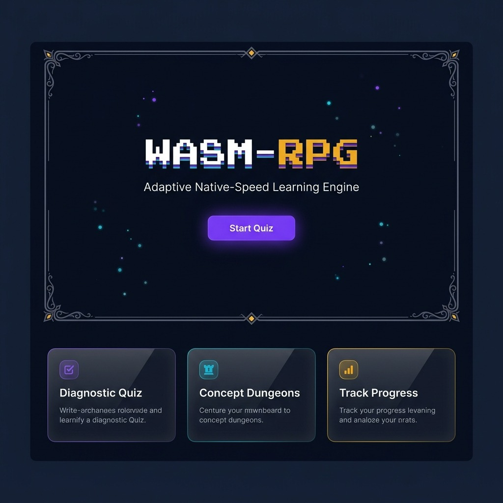
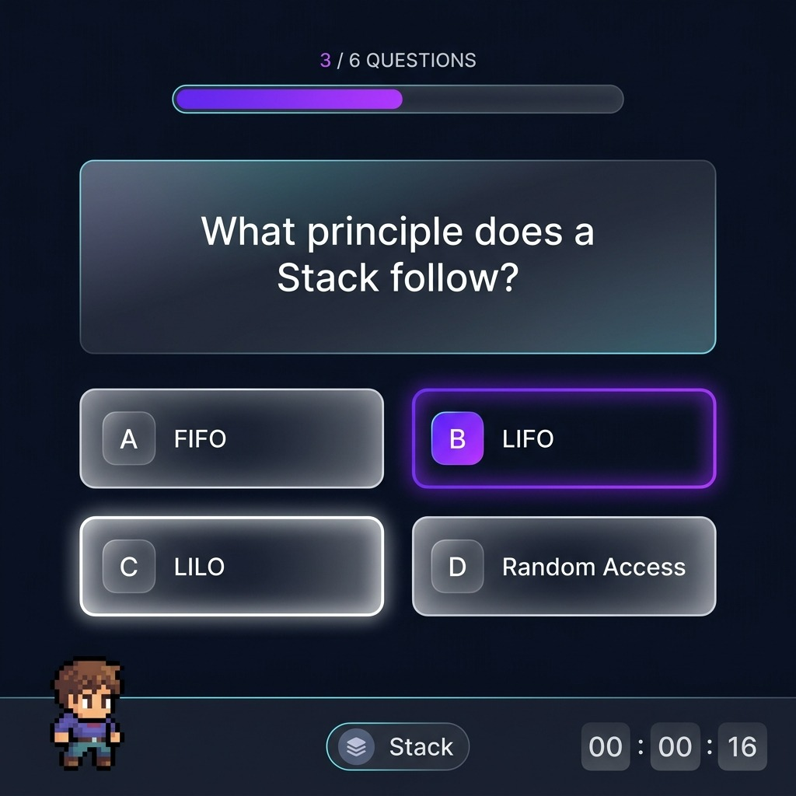
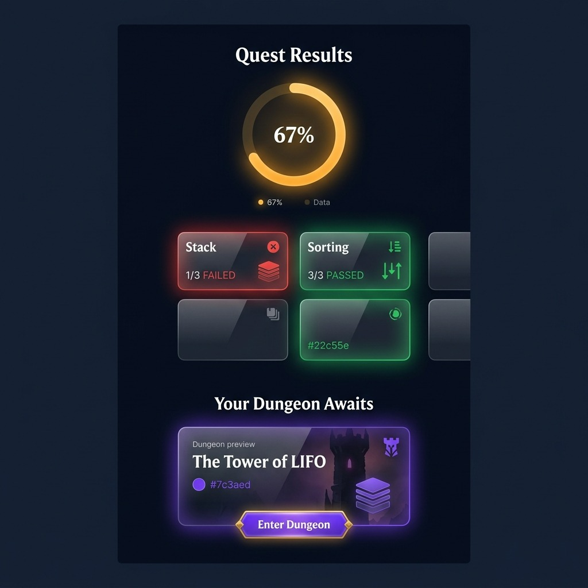
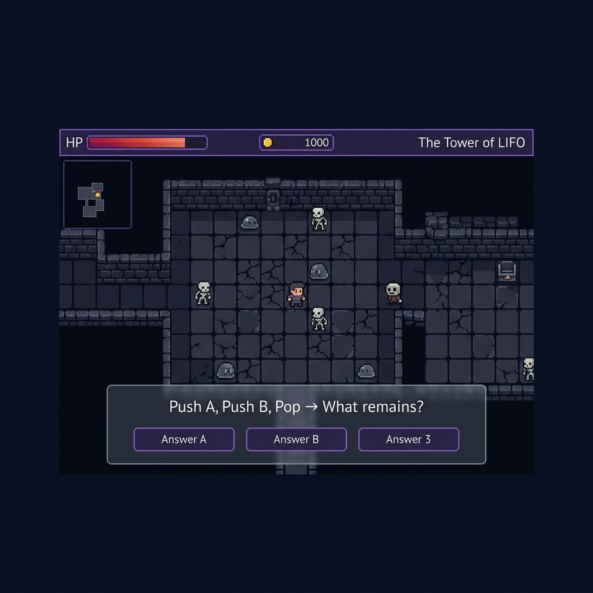
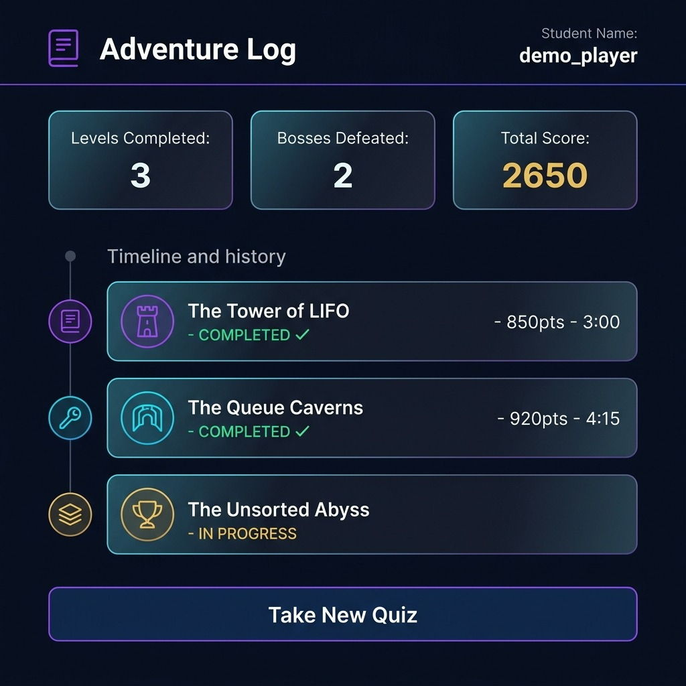

# WASM-RPG: UI/UX Design Specifications
**For: Frontend Developer (Member 1)**

This document outlines the design system, UI architecture, and provides detailed wireframes for building the WASM-RPG React frontend.

---

## 🎨 1. Design System & Tokens
The application relies strictly on a **Dark Glassmorphism** aesthetic combining slick modern UI with embedded 16-bit RPG elements constraints.

### **Color Palette (Tailwind configured in frontend/tailwind.config.js)**
- **Background (`bg-background`):** Deep Navy `#0a0e1a`
- **Primary (`text-primary`, `bg-primary`):** Electric Purple `#7c3aed` (Primary actions, CTA buttons)
- **Secondary (`text-secondary`):** Cyan `#06b6d4` (Highlights, neutral info)
- **Accent (`text-accent`):** Gold `#f59e0b` (Awards, scores, player highlights)
- **Danger (`text-danger`):** Red `#ef4444` (Fail states, enemy attacks)
- **Success (`text-success`):** Green `#22c55e` (Pass states, cleared levels)
- **Glass Panel Base (`bg-panel`):** `rgba(30, 41, 59, 0.7)`

### **Typography**
- **Modern Readability (`font-sans`):** `Inter` (Standard text, instructions, quiz questions).
- **RPG Elements (`font-pixel`):** `"Press Start 2P"` (Headers, CTA text, game overlays, stats).

### **Core UI Patterns**
1. **Glass Panels:** Use `.glass-panel` utility class for all cards, containers, and dialogs.
2. **Buttons:**
   - Primary Calls to Action: `.btn-primary` (Purple with outer glow effect)
   - Secondary Actions: `.btn-secondary` (Outline with inner glow)
3. **Background Layout:** An ambient animated background using dual radial gradients (pre-configured in `src/index.css`) applies to ALL screens except when the game canvas takes full screen.

---

## 🖼️ 2. Core Screens & Wireframes

### **1. Landing Page (`/` route)**
The entry point. Focus on creating immediate immersion.
- **Key Elements:** Center vertical alignment, animated pulsing title, high contrast CTA.
- **Implementation Status:** Boilerplate already implemented in `App.tsx`!

### **2. Diagnostic Quiz (`/quiz` route)**
The evaluation phase where users are tested on their knowledge.
- **Key Elements:** 
  - Top visual progress bar.
  - Question card with standard sans-serif font for high readability.
  - Four isolated glass-panel answers. Selected answers glow with border-color.
- **UX Goal:** Quick, zero-friction selection mimicking modern learning apps.

### **3. Quest Results (`/results` route)**
Displays topic scores mapped to PASS/FAIL (where PASS_THRESHOLD is 0.5 per backend).
- **Key Elements:** 
  - Central score ring component (svg chart).
  - Diagnostic grid mapping each topic (Requires clear visual red/green distinctions).
  - Bottom CTA panel routing into the procedurally generated dungeon for the failed topics.

### **4. Game HUD & Overlay (`/game` route)**
Wraps the Emscripten/SDL2 compiled App container.
- **Key Elements:** 
  - Minimal overlay to not disrupt C++ rendering.
  - Top bar: HP/Stats overlay.
  - Bottom panel: Only appears during boss fights (when JS<->C++ bridge invokes `showBossQuestion()`).

### **5. Adventure Log (`/progress` route)**
The user profile and history timeline showing completed levels.
- **Key Elements:** 
  - Statistical top row (Levels completed, bosses, points).
  - Timeline list of past dungeons with status badges.

---

## 🚀 3. Starting Work (Instructions for Member 1)

1. The boilerplate is fully scaffolded in the `frontend` directory using React + TypeScript + Vite.
2. Tailwind bindings, theme extensions, and CSS utilities (glassmorphism rules) are already set up in `tailwind.config.js` and `src/index.css`.
3. `react-router-dom` and `axios` are installed. Core routing exists in `src/App.tsx`.

### **Immediate Next Steps for M1:**
- Scaffold the 4 missing screen components (`Quiz.tsx`, `Results.tsx`, `Game.tsx`, `Progress.tsx`) based on the wireframes above.
- Connect the frontend axios calls to the backend running locally on `http://localhost:8000`.
- Prioritize implementing the **Quiz logic** and state machine since without it, the game has no setup.
